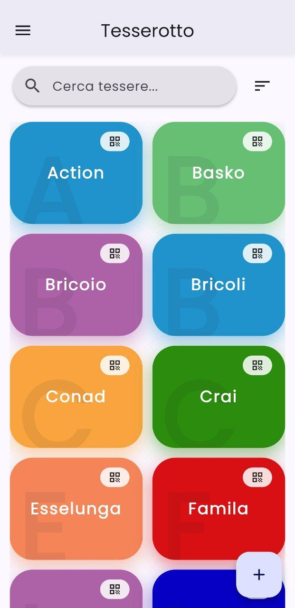
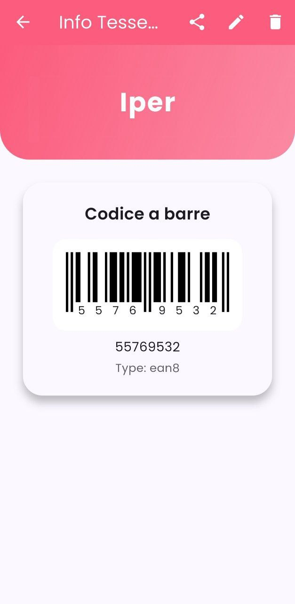

  
  

# Tesserotto: Fidelity Card Management System

## Panoramica del Progetto
Tesserotto è un'applicazione mobile sviluppata con il framework Flutter, nata dall'esigenza di disporre di un wallet digitale per carte fedeltà leggero, indipendente e focalizzato sulla privacy dell'utente. Il progetto sorge come alternativa self-hosted e priva di tracciamento a seguito della migrazione di piattaforme commerciali (Stocard/Klarna) verso ecosistemi finanziari complessi, restituendo all'utente il pieno controllo dei propri dati.

## Architettura Tecnica

### 1. State Management & Pattern
L'applicazione adotta il pattern **ChangeNotifier** tramite il framework `Provider` per la gestione reattiva dello stato. 
* **FidelityCardsProvider:** Coordina il ciclo di vita dei dati delle tessere, interfacciandosi con il layer di persistenza e notificando la UI per gli aggiornamenti in tempo reale.
* **Settings & Theme Providers:** Gestiscono le configurazioni globali come la localizzazione e il passaggio dinamico tra Dark e Light mode.

### 2. Layer di Persistenza (SQLite)
La gestione dei dati è affidata a un database relazionale locale tramite `sqflite`.
* **DatabaseHelper:** Implementa il pattern Singleton per la gestione della connessione e le operazioni CRUD sullo schema `fidelity_cards`.
* **Privacy:** I dati risiedono esclusivamente nel sandbox dell'applicazione, senza sincronizzazioni cloud non autorizzate.

### 3. Deep Linking & Interoperabilità
Il sistema include un servizio dedicato alla gestione dei Deep Links (`DeepLinkService`), permettendo l'interazione con l'applicazione tramite schemi URI personalizzati per l'importazione rapida di dati o l'apertura diretta di tessere specifiche.

### 4. Internazionalizzazione (l10n)
L'interfaccia supporta nativamente il multi-lingua tramite file di localizzazione ARB (attualmente Italiano e Inglese), permettendo una scalabilità agevole verso altri mercati.

## Funzionalità Core
* **Gestione Tessere:** Inserimento, modifica e cancellazione di carte fedeltà con supporto a molteplici formati di codici a barre e QR.
* **Visualizzazione Avanzata:** UI ottimizzata per la lettura degli scanner alle casse, con gestione automatica della luminosità e overlay dei dettagli.
* **Import/Export:** Funzionalità di backup dei dati locali per garantire la portabilità delle informazioni tra dispositivi.
* **UI/UX:** Utilizzo di componenti personalizzati (`AnimatedCard`) e transizioni di pagina fluide per un'esperienza utente di alto livello.

## Struttura del Repository
* `/lib/database`: Logica di inizializzazione e gestione SQLite.
* `/lib/models`: Definizione delle entità dati (FidelityCard).
* `/lib/providers`: Logica di business e gestione dello stato.
* `/lib/screens`: Implementazione delle interfacce utente (Home, Details, Settings, Add).
* `/lib/services`: Integrazioni con i servizi di sistema (Deep Linking).
* `/lib/widgets`: Componenti UI riutilizzabili e logiche di animazione.

## Requisiti di Sviluppo
* Flutter SDK (Canale Stable).
* Dart SDK compatibile con le definizioni in `pubspec.yaml`.
* Android SDK / iOS Xcode per la compilazione mobile.

---
*Nota: Tesserotto è un progetto indipendente sviluppato per fornire una soluzione trasparente e funzionale alla gestione delle tessere digitali.*
